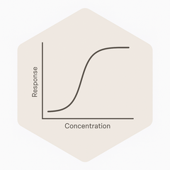

<!-- README.md is generated from README.Rmd. Please edit that file -->

# exposr



<!-- badges: start -->
<!-- badges: end -->

**exposr** is an R package that aspires to provide a flexible and
extensible toolkit for exposure–response analysis and pharmacometric
data exploration.

Designed by and for pharmacometricians, `exposr` aspires to bridge the
gap between simulation, visualization, and decision-support in
model-informed drug development (MIDD). It will support intuitive
workflows for both exploratory data analysis and communication of
results to scientific and regulatory stakeholders.

## Installation

You can install the development version of exposr from
[GitHub](https://github.com/) with:

``` r
# install.packages("devtools")
devtools::install_github("TheoPapath/exposr")
#> Skipping install of 'exposr' from a github remote, the SHA1 (ba79f2c9) has not changed since last install.
#>   Use `force = TRUE` to force installation
```

------------------------------------------------------------------------

## 🚀 Why exposr?

In pharmacometrics, we frequently ask: - How does drug **exposure**
relate to **efficacy** or **safety**? - Is there a consistent
**dose–exposure–response** relationship across trials? - Can we
visualize trends and model predictions in a way that’s **clear and
credible**?

`exposr` is built to help answer these questions with:

- ✅ Clean, publication-ready exposure–response plots
- ✅ Support for external model overlays and prediction ribbons
- ✅ Dose binning and summary tools that respect clinical structure
- ✅ Flexible trend fitting (e.g. LOESS, GLM, Emax)
- ✅ Annotations for go/no-go thresholds and effect levels
- ✅ Utility functions for simulation, model diagnostics, and more (in
  development)

------------------------------------------------------------------------

## ✨ Key Features

- **`plot_exposure_response()`**: A core visualization tool that
  handles:
  - Dose, exposure, and response layering
  - Grouping by trial or covariates
  - Trend overlays (LOESS, linear, Emax, etc.)
  - Exposure bin summaries with 95% CIs
  - Prediction overlays from external models
  - Median line annotations, effect crosshairs, and more
- **Simulation support** *(coming soon)*:
  - Dose–response data generation with random effects
  - Dropout modeling and interim decision logic
  - Multiple-dose and longitudinal design exploration
- **Future tools** *(planned)*:
  - Vignettes and templates for reporting

------------------------------------------------------------------------

## 📦 Installation

``` r
# You can install the development version from GitHub:
# install.packages("devtools")
devtools::install_github("TheoPapath/exposr")
#> Skipping install of 'exposr' from a github remote, the SHA1 (ba79f2c9) has not changed since last install.
#>   Use `force = TRUE` to force installation
```

## 🧪 Example Usage

``` r
library(exposr)

# plot_exposure_response(
#   data = my_data,
#   dose_var = Dose,
#   exposure_var = AUC,
#   response_var = Response,
#   group_var = Trial,
#   summary_type = "geometric",
#   add_trend = TRUE,
#   trend_method = "emax",
#   trend_ci = TRUE
# )
```

🧬 Target Audience This package is designed for:

- Pharmacometricians
- Clinical pharmacologists
- Quantitative scientists

## 🌍 Vision

The goal of exposr is to become a lightweight but powerful companion
package for pharmacometricians — supporting rapid iteration, insightful
communication, and reproducible science.

Whether you’re prototyping an exposure–response model, exploring trial
simulations, or assembling results for an IND, exposr aims to support
your workflow.

## 📚 Contributing

Pull requests, feature suggestions, and bug reports are welcome! The
development roadmap is maintained under issues.

To contribute:

1)  Fork the repo
2)  Create a feature branch
3)  Submit a pull request with clear notes

## 💬 Feedback

If you’re using exposr in a project or want to collaborate on new
features, get in touch!

You can open an issue or contact me directly.
